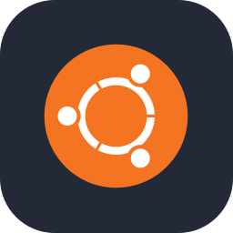
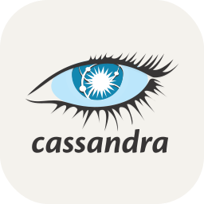

# Hi, I'm Saad! 💻 **Backend Developer**

Welcome to my GitHub profile.

---

# 🎨 **About Me**

- 💻 **I love coding**
- 🛠️ **Currently working as:** Laravel Backend Developer
- 🐧 **Currently Learning:** NodeJs,Linux and Docker
- 🤖 **College specialty:** Artificial Intelligence

---

### 💻 **Back End Development**

  
  
  
  
  
  
  
  
  

### 🗃️ **Databases**

  
  
  

### 🌈 **Front End Development**

  
  
  
  
  
  

### 🛠️ **DevOps & Infrastructure**

  
  
  
  
  
  
  
  
  
  

### 🔧 **Others**

  
  
  
  
  
  
  
  
  
  

### 🎮 **Game Development**

  
  

### 🎨 **Design & Creative**

  

### 🤖 **AI/ML**

  
  
  

### **I Want To Learn**

  
  
  
  
  
  
  
  

---

---

⭐ **Thanks for visiting!** ⭐3
