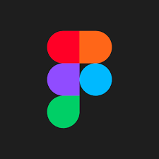
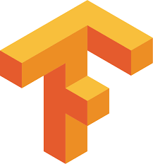
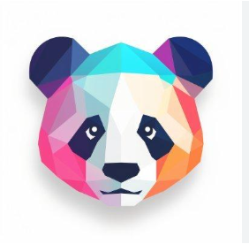

# 🌸 Hey there, I’m Sara!

Welcome to my little corner of the internet! 🌍💜
I'm a Frontend Developer who loves turning ideas into interactive, user-friendly experiences. 🖥️💡

---

- ⭐ Passionate about: Art, coding, reading, and learning new things
- 🚀 **Currently working as:** Web Developer
- 🦄  **Currently Learning:** Nextjs & UI/UX
- 🤖 **College specialty:** Artificial Intelligence
- **I'm looking to collaborate on new business ideas  🦋**

---

### 🎨 **Front End Development**

  
  
  
  
  
  
  
  
  
  

### 💻 **Back End Development**

  
  
  
  
  
  

### 🛠️ **DevOps & Infrastructure**

  
  
  
  
  
  

### 🔧 **Others**

  
  
  
  
  
  
  

### 🤖 **AI/ML**

  
  
  
  
  
  
  
  
  

### **I Want To Learn**

---

---
